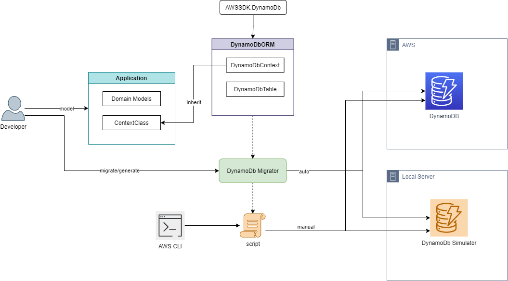

# DynamoDbORM

DynamoDbORM is an object-relational mapping .Net library for DynamoDB. It maps the model defined in the C# class directly with the Dynamodb. 

---
## Summary

- [DynamoDbORM](#dynamodborm)
  - [Summary](#summary)
  - [Why DynamoDbORM?](#why-dynamodborm)
  - [Features](#features)
  - [How DynamoDbORM works?](#how-dynamodborm-works)
  - [Installing DynamoDbORM library](#installing-dynamodborm-library)
  - [Installing DynamoDbMigrator](#installing-dynamodbmigrator)
  - [DynamoDbMigrator Command Line Reference](#dynamodbmigrator-command-line-reference)

## Why DynamoDbORM?
In a typical scenario, the model for AWS dynamodb is created either using a cloud formation template or by using aws cli commands. Then the modes are defined as classes in C# and mapped. If there is any change in the model a developer has to do code change in both places. DynamoDbORM library will address this problem. The library follows the code first approach where the domain models are defined as C# classes and then automatically migrate those models to dynamodb. 

## Features
Some of the features of DynamoDbORM,

- DynamoDbORM library synchronizes the model between the C# and dynamodb database.
- It helps to automatically migrate the models to dynamodb
- Generate the script from the models defined.

## How DynamoDbORM works?
The developer starts defining the models in their own application and create a context class derived from DynamoDbContext and include the tables using DynamoDbTable. Both DynamoDbContext and DynamoDbTable are defined in the DynamoDbORM library. The library internally uses AWSSDK.Dynamodb library from AWS. The library encapsulates most of the complex stuff for creating a table in dynamodb.

Once the definition is done, the DynamoDbMigrator is used to migrate all the domain models to dynamodb. The DynamoDbMigrator is a command-line utility. The migration can either happen directly with the migrator itself or else we can also generate script and deploy. The script is generated based on AWS CLI. For the script to execute AWS CLI to be installed.

## Installing DynamoDbORM library

## Installing DynamoDbMigrator

DynamoDbMigrator tool is published in TU artifactory from this locaion 

You can install the tool by the below command,

>       dotnet tool install --global --add-source ./DynamoDbMigrator --version [version-no]

Access the dynamodb migrator using the following command,
>       ddbm --version

Uninstall the tools as follow,
>       dotnet tool uninstall --global DynamoDbMigrator

## DynamoDbMigrator Command Line Reference

The help menu for the dynamodb migrator can be retrieve as follows,

> C:\Users\arvenka>ddbm --help
>  
>       migrate    Migrate dynamodb context model to aws dynamodb
> 
>       script     Generate script for aws dynamodb from context model
> 
>       help       Display more information on a specific command.
> 
>       version    Display version information.

The help menu for migrate is shown below,

> C:\Users\arvenka>ddbm migrate --help
> 
>       -u, --url               Dynamodb url
> 
>       -n, --tablenames        TableNames With Key value Pair. 
>                               Ex:"[{\"Key\":\"DatasourceConfiguration\",>\"Value\":\"gtpiac-pseac-ue1-ddb-dev-ops-dsc\"}]"
> 
>       -a, --access-key        AWS access key
> 
>       -s, --secret-key        AWS secret key
>        
>       -t, --token             AWS session token
> 
>       -p, --path              Required. Path to dynamo db context assembly dll file
> 
>       -c, --context           Dynamodb context class
> 
>       -f, --force-recreate    (Default: false) Remove existing tables and recreate again
> 
>       --help                  Display this help screen.
> 
>       --version               Display version information.

The help menu for script is shown below,
> C:\Users\arvenka>ddbm script --help
> 
>       --type                  Required. Type of script. Use 'ps' for powershell and 'sh' for bash script
> 
>       -o, --output            Required. Output path for script file
> 
>       -u, --url               Dynamodb url
> 
>       -p, --path              Required. Path to dynamo db context assembly dll file
> 
>       -c, --context           Dynamodb context class
> 
>       -f, --force-recreate    (Default: false) Remove existing tables and recreate again
> 
>       --help                  Display this help screen.
> 
>       --version               Display version information.